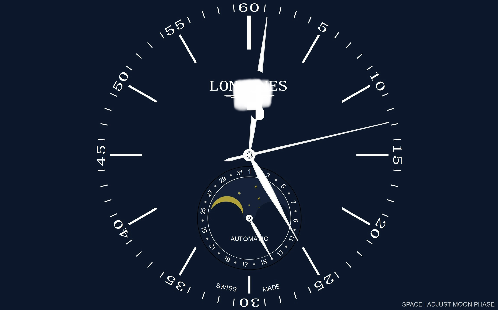

# 月相机械表高度模拟屏保

一个用 PyQt5 制作的模拟机械表表盘屏保程序，包含时分秒针、日期指针和月相显示。

## 效果预览



## 功能特点

- 🕐 平滑运动的时、分、秒针
- 📅 日期指针（31天刻度）
- 🌙 月相显示（按空格键手动调整）
- 🖥️ 全屏显示

## 免责声明

本项目为个人学习与技术交流之目的，仅供非商业用途使用。

本人作为钟表爱好者，代码仅为模拟表盘显示功能的技术练习，不隶属于任何钟表品牌。

项目中的设计元素仅供演示，相关商标及标识归属于其各自的权利持有人。

本项目代码采用 MIT 许可证开源，但任何使用均不得侵犯他人合法权益。

## 运行方法

### 安装依赖

```bash
pip install -r requirements.txt


### 运行程序
python LONGINSS-GIT.py
